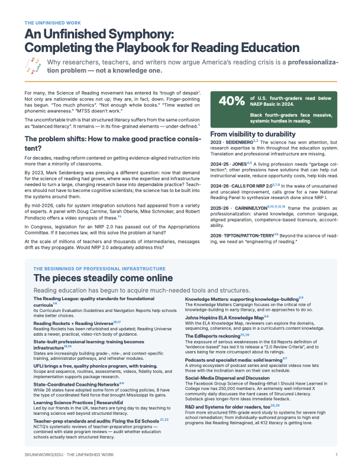

# An Unfinished Symphony
### Completing the Playbook for Reading Education

A research-to-practice brief arguing that America's reading crisis is now a **professionalization problem** — not a knowledge one. While the Science of Reading seems to have won the argument, still missing is the infrastructure to make good practice consistent at scale.

[](Unfinished_Symphony.pdf)

## The argument in brief

An emerging consensus among researchers (Seidenberg, Carnine, Lyon, Tipton & Patton-Terry) is that the bottleneck has shifted: the research base is strong enough, but it has no reliable path from expert knowledge to the median classroom.

This brief notes what *has* come online — Reading Universe, state coaching networks, NCTQ audits, TRL curriculum reviews, EdReports 2.0 — and identifies what's still missing: an **integrating framework** that ties those pieces together and keeps them current.

It considers four approaches to building such a framework:

| Approach | |
|---|---|
| NRP 2.0 | |
| Engineering of Reading | |
| Field Manual System | Taking lessons from the US military. A highly considered and iterated system of professional development |
| Community-Maintained Canonical Source | The open-source model applied to reading education — named maintainers, version control, issue tracking, public review |

The core claim: **the current publish-and-forget model** makes teaching too hard for mere mortals. A community-maintained system would better capture the best practices and reasons therefor.

## File

| File | Description |
|---|---|
| `Unfinished_Symphony.typ` | Main Typst source for the brief |
| `Unfinished_Symphony.pdf` | Compiled PDF output |
| `canonical-source-roles.png` | Diagram embedded on the infrastructure page |

## Compiling to PDF

Requires [Typst](https://typst.app) and the **Inter** and **Inter Display** font families.

```sh
typst compile Unfinished_Symphony.typ
```

## References

The brief cites 31 sources (2023–2026), including work by Mark Seidenberg, Douglas Carnine, G. Reid Lyon, Elizabeth Tipton & Nicole Patton-Terry, the Reading League, NCTQ, EdReports, AERDF, etc.
